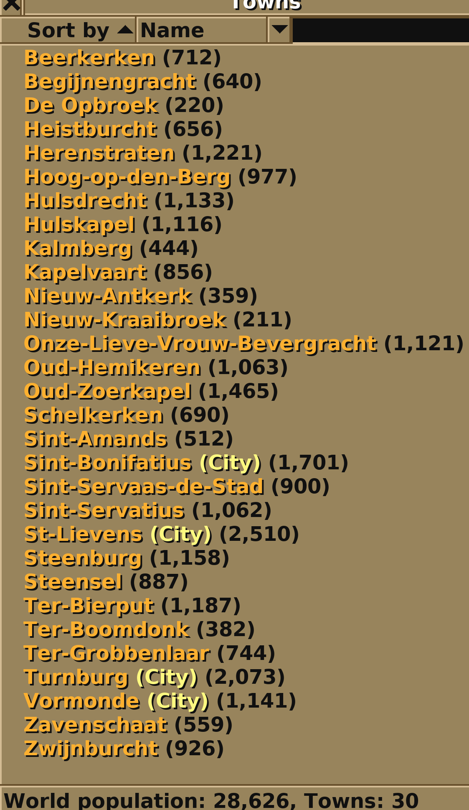
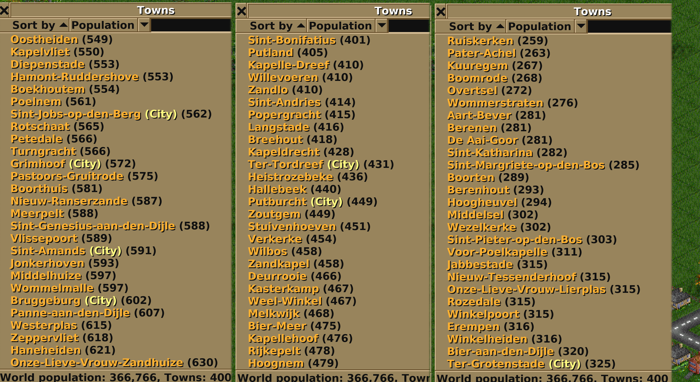
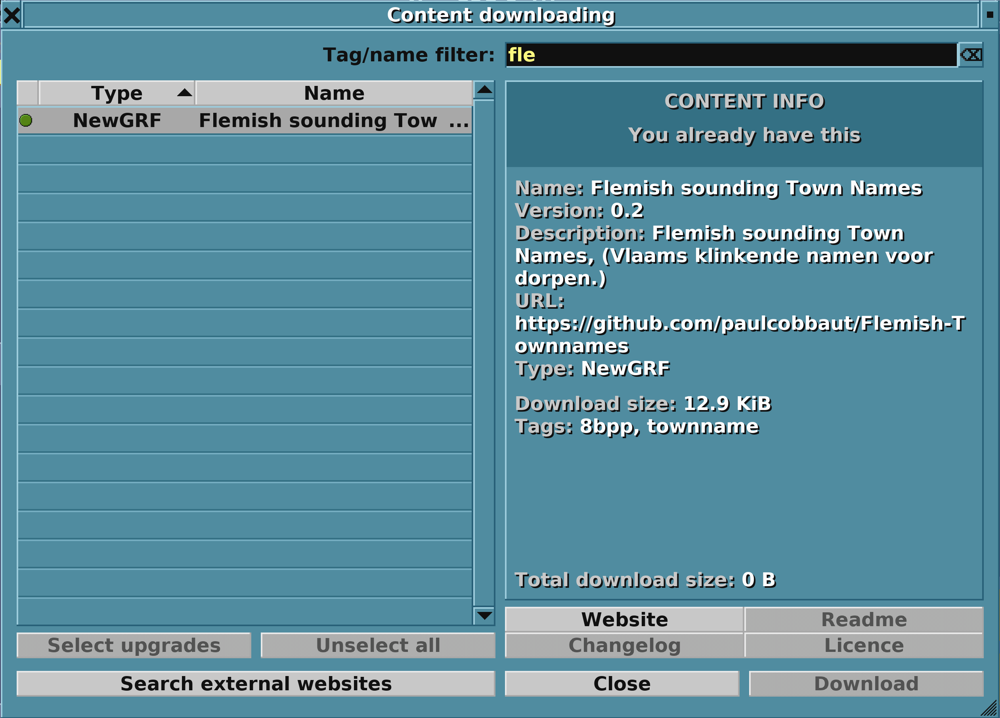

# OpenTTD newgrf for Flemish Town Names

A humble way of generating random town names that resemble Flemish.

https://bananas.openttd.org/package/newgrf/50430101

v0.4 screenshot

v0.3 screenshot

v0.2 screenshot

